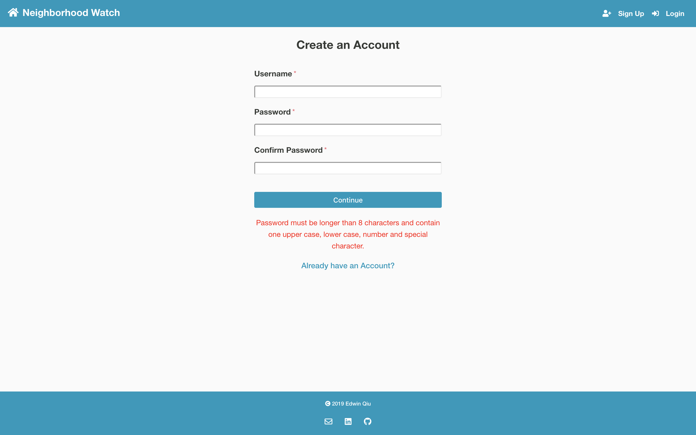
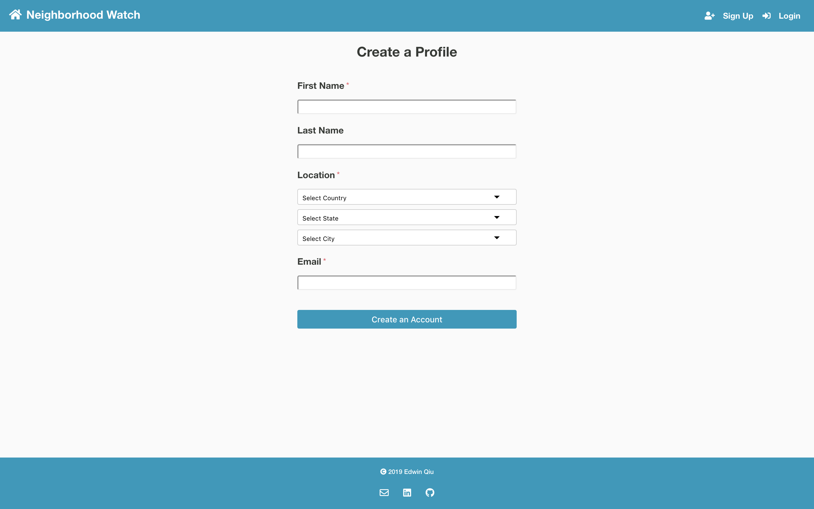
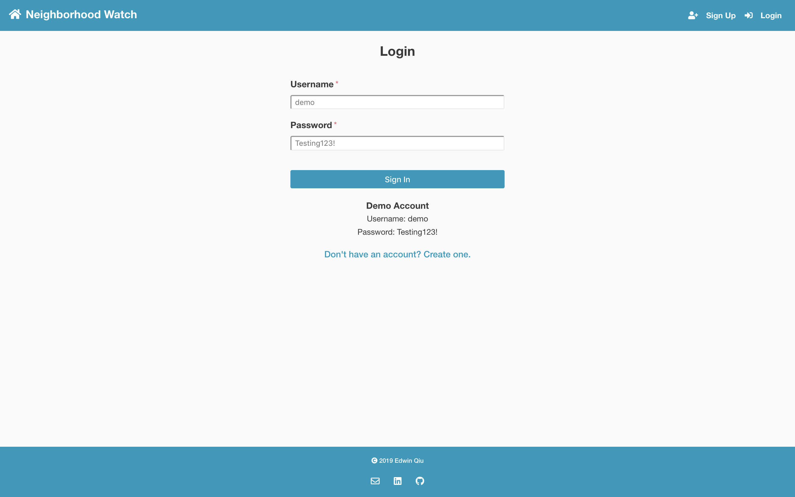
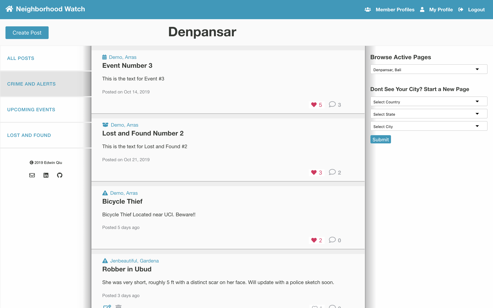
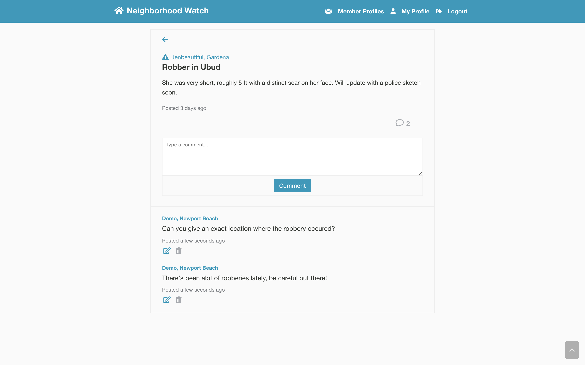
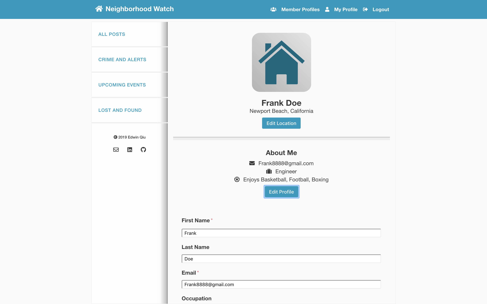
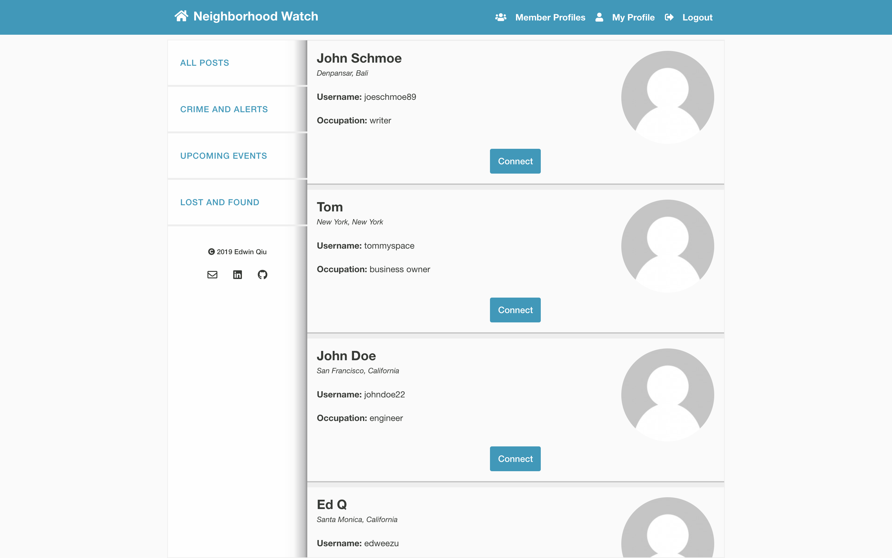

# Neighborhood Watch

Neighborhood Watch is a social community app that allows users to stay informed about what's going on in their city or other cities that they might be interested in. Users can search for upcoming events, stay on their toes about the latest local crime, or browse through our extensive Lost and Found section. Users can also connect with their fellow neighbors who choose to leave their profile on public and possibly make lifelong friendships.

## Demo

- Live Preview can be found at : https://neighborhood-watch-client.now.sh/

## Client Side Github Repo

- https://github.com/Edweezu/neighborhood-watch-client

## Screenshots

|  Landing Page  | Create Account | Create Profile |  Login |  
| -- | -- | -- | -- | 
|  |  |   |  

|  Main Dashboard  |  Post Page  |  User Profile  | Member Profiles | 
| -- | -- | -- | -- |
|  |  |  | 

## Schema Design

## Route Paths

### Users
**/api/users**
- GET
  - Returns a 200 response containing all registered users currently in the database
  
**/api/users/register**
- POST
  - Creates a new user with the information from the request body and saves it to the database. Hashes the password and returns a 201 response with only the username
  - If any required fields are missing, returns a 400 response
  - If username already exists, returns a 400 response

**/api/users/register/:userid**
- PATCH
  - Updates the user with the supplied userid using the information provided in the request body and saves it to the database. Uses the username and userid to create a JWT token to send back to the user
  - If any required fields are missing, returns a 400 response
 
**/api/users/login** 
- POST
  - Uses the information provided in the request body to check if the username exists and if the password matches the hashed password in the database. If so, returns a JWT token to send back to the user
  - If any required fields are missing, returns a 400 response
  - If username doesn't exist or password doesn't match, returns a 400 response
  
**/api/users/profile** 
- GET
  - Returns a 200 response containing all the user information pertaining to the user currently logged in
- PATCH
  - Updates the logged in user with the info provided in the request body. If the request body contains an image, it first uploads that image onto Cloudinary and attaches the Cloudinary URL onto the object that is saved to the database. If there is no image, it simply updates the user in the database and returns the user info back to the client.
  - If user doesn't exist, returns a 400 response 

### Posts
**/api/posts** 
- GET
  - Returns a 200 response containing all posts located in the database and serializing them before sending it back to the client
- POST
  - Creates a new post with the information from the request body, saves it to the database, and sends the post back to the client. If the request body contains an image, the image is first uploaded onto Cloudinary. A reference url is then attached onto the new post before saving it in the database
   - If any required fields are missing, returns a 400 response

**/api/posts/:postid**
- GET
  - Returns a 200 response with the serialized post with the supplied postid in the request params. 
  - If post doesn't exist, returns a 400 response
- PATCH
  - Updates the specific post with the info provided in the request body. If the request body contains an image, the image is first uploaded onto Cloudinary. A reference url is then attached onto the post to be updated before saving it in the database
- DELETE
  - Deletes the desired post according to the supplied postid. Simply returns a 204 response to client.
  - If no post exists in the database, returns a 400 response

**/api/posts/:postid/likes**
- GET
  - Returns a 200 response with an array of objects containing all the users that liked the specific post
- POST
  - Creates a new user like for the supplied postid and saves it in the database. Returns an array of objects containing all users that liked the post
   - If user already liked the post, returns a 400 response
- DELETE
  - Deletes the user's like for the specific post. Returns an updated list containing all users that have liked the post.
  
### Comments
**/api/comments** 
- GET
  - Returns a 200 response containing all comments located in the database and serializing them before sending it back to the client
- POST
  - Creates a new comment with the info provided in the request body and saves it to the database. Returns a 201 response with the comment path and a serialized comment
   - If any required fields are missing, returns a 400 response
 
**/api/comments/:commentId**  
- GET
  - Returns a 200 response containing the serialized comment that was provided in the request params
  - If comment doesn't exist in the database, returns a 400 response
- PATCH
  - Updates the comment supplied in the request params with the info provided in the request body. Returns a serialized comment back to the client
   - If any required fields are missing, returns a 400 response
- DELETE
  - Deletes the specific comment that was supplied in the request params
  - If no comment exists in the database, returns a 400 response
  
### Places
**/api/places** 
- GET
  - Returns a 200 response containing all places or locations that are currently in the database
- POST
  - Creates a new place with the info provided in the request body. Returns a 201 response with the place path as well as the serialized place
  - If place already exists, returns a JSON object alerting the client that the place has already been created
  
  
## Technologies Used
  - Javascript
  - CSS3
  - React
  - Node
  - Express
  - PostgreSQL
  - Mocha
  - Chai
  - Heroku
  - Geocities API
  

## Development RoadMap (v2)
 - Implementing a Post Image Modal that expands a post image on click
 - Ability to filter for a collection of posts depending on the search term
 - Expanding the User's Profile Page by adding in sections for a user's posts and comments
 - Adding a user image to go along with each post and comment 

